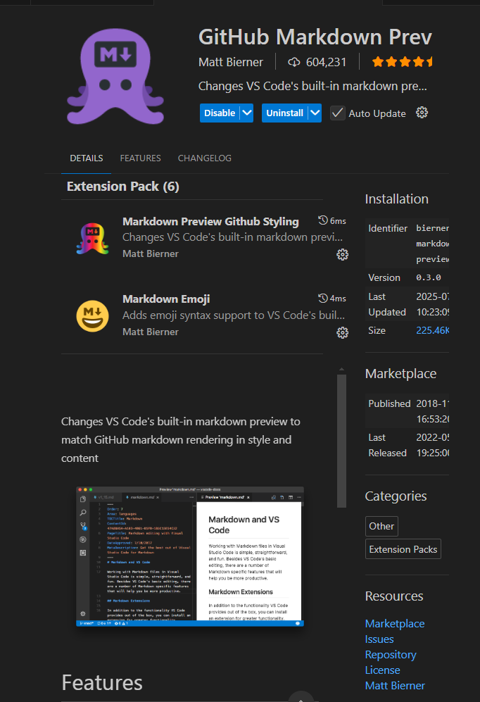

# Learned Enhancing with Copilot on Coursera

In this lesson I learned how to utilize copilot for creating HTML web pages, with CSS Styling, and JavaScript interactivity. 

## 1. What I created using Copilot
- HTML documents 
- CSS Styling
- Javascript 

## 2. What you will find on my site
- Home Page

- About Page

- Services Page

- Project Page

- Articles Page

- Contact Page


# Learned How to Create README.md file on Youtube
In this lesson I learned how to create and use the readme file for demonstration of my project. 

## 1. Extensions Used 

- *github* markdown preview by Matt Briener
- Markdown Emoji by Matt Briener

## 2. Emoji Link
You can find the emojis here: 

<https://www.webfx.com/tools/emoji-cheat-sheet/>

## Other Markdown Editors to Use
1. Mac : **MacDown**
2. Windows: **ghostwriter** or **MarkdownEditor**

# Learned How Create Readme on Youtube
1. To load an image use an exclamation mark in square brackets **![Alternate text]** e.g ![image of a cat]


2. To show single code using markdown use backticks `` for example: 
`print("Hello Word")`

3. To show multiple lines of code use three backticks then pass in the code in between the backticks and reference the language use for example: 
```javascript
document.addEventListener("DOMContentLoaded", function() {
    const navToggle = document.getElementById('nav-toggle');
    const navLinks = document.querySelectorAll('.nav-links a');

    if (navToggle && navLinks.length > 0) {
        navLinks.forEach(link => {
            link.addEventListener('click', function() {
                if (navToggle.checked) {
                    navToggle.checked = false;
                }
            });
        });
    }
});


window.addEventListener('DOMContentLoaded', function() {
    function handleTextColor() {
        if (window.innerWidth > 768) {
            document.querySelector('.nav-links').style.color = 'white';
        } else {
            document.querySelector('.nav-links').style.color = '';
        }
    }
    window.addEventListener('resize', handleTextColor);
    handleTextColor();
});
document.addEventListener("DOMContentLoaded", function() {
    // Style headers (h1, h2, h3, etc.)
    const headers = document.querySelectorAll('h1, h2, h3, h4, h5, h6');
    headers.forEach(header => {
        header.style.fontFamily = 'Arial, sans-serif';
        header.style.fontWeight = 'bold';
        header.style.textDecoration = 'none';
        header.style.marginTop = '1em';
        header.style.marginBottom = '0.5em';
    });

    // Remove underlining from all links
    const links = document.querySelectorAll('a');
    links.forEach(link => {
        link.style.textDecoration = 'none';
    });

    // Remove bullets from all lists
    const lists = document.querySelectorAll('ul, ol');
    lists.forEach(list => {
        list.style.listStyle = 'none';
        list.style.paddingLeft = '0';
    });

    // Hide hamburger menu on non-mobile displays
    function handleHamburgerDisplay() {
        const navToggleLabel = document.querySelector('label[for="nav-toggle"]');
        if (window.innerWidth > 768) {
            if (navToggleLabel) navToggleLabel.style.display = 'none';
        } else {
            if (navToggleLabel) navToggleLabel.style.display = '';
        }
    }

    window.addEventListener('resize', handleHamburgerDisplay);
    handleHamburgerDisplay();
});


//if the contact button is clicked, redirect to the contact page - onclick="location.href='contact.html'"
const contactButton = document.getElementById('contact-button');
if (contactButton) {
    contactButton.addEventListener('click', function() {
        // Redirect to the contact page
        window.location.href = 'Contact.html';
    });
}

const contactForm = document.getElementById('contact-form');
const nameInput = document.getElementById('name');
const emailInput = document.getElementById('email');
const messageInput = document.getElementById('message');
if (contactForm && nameInput && emailInput && messageInput) {
    contactForm.addEventListener('submit', function(event) {
        event.preventDefault();

        const name = nameInput.value.trim();
        const email = emailInput.value.trim();
        const message = messageInput.value.trim();

        if (name && email && message) {
            // Simulate storing the data as if sending an email
            const emailData = {
                name: name,
                email: email,
                message: message,
                sentAt: new Date().toISOString()
            };
            // Store in localStorage (for demonstration)
            let sentEmails = JSON.parse(localStorage.getItem('sentEmails') || '[]');
            sentEmails.push(emailData);
            localStorage.setItem('sentEmails', JSON.stringify(sentEmails));

            alert('Your message has been sent!');
            contactForm.reset();
        } else {
            alert('Please fill out all fields.');
        }
    });
}

document.addEventListener("DOMContentLoaded", function() {
    const navLinks = document.querySelectorAll('.nav-links a');
    const currentPath = window.location.pathname.split('/').pop().toLowerCase();

    navLinks.forEach(link => {
        const linkPath = link.getAttribute('href').split('/').pop().toLowerCase();
        if (linkPath === currentPath || (linkPath === '' && currentPath === '')) {
            link.classList.add('active-nav-link');
        } else {
            link.classList.remove('active-nav-link');
        }
    });
});
```
# Summary 
This is how I've enhanced my skills using Copilot and Youtube, for more reference you can find my project here: 
**githublink** 